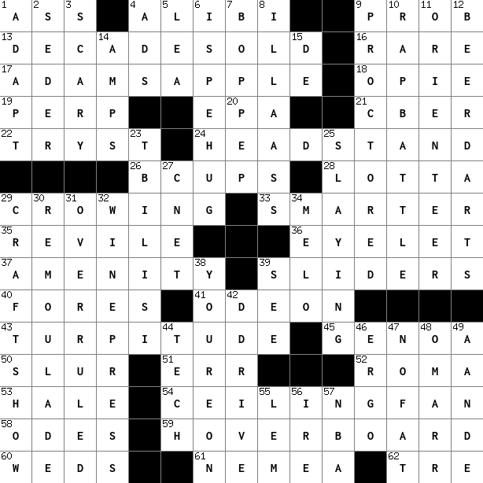
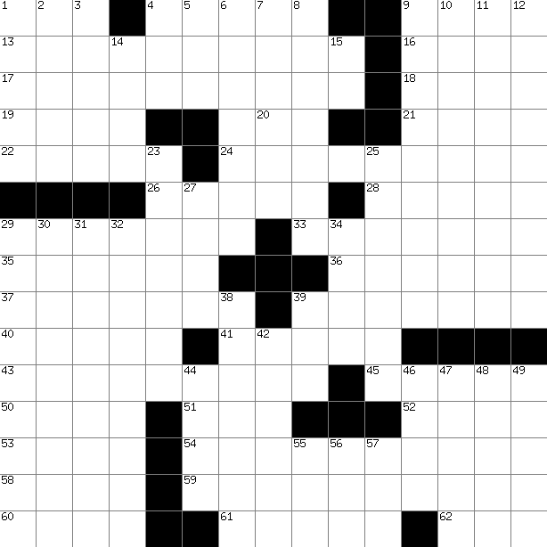

# Go Crossword Renderer


## Usage

```bash
go run main.go <csv_file> [numbers_csv] <output_filled> <output_empty>
```

- `csv_file`: CSV file representing the crossword grid
- `numbers_csv`: Optional CSV file for adding clue numbers to crossword cells
- `output_filled`: Output PNG file with answers
- `output_empty`: Output PNG file without answers (blank puzzle)

## Examples



  
